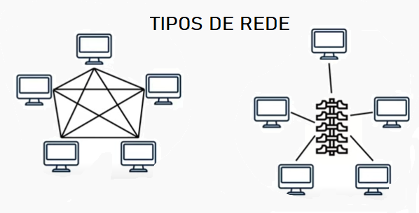

# 1. Evolução da internet
##  a. História da Internet
  - 1969 - Arpanet criada no Departamento de Defesa dos EUA
  - 1982 - Rede de comunicação entre universidades européias
  - 1987 - Uso comercial nos EUA
  - 1988 - Uso em centros de pesquisa no Brasil
  - 1992 - World Wide Web (WWW) criada pelo CERN, acessível a qualquer pessoa com conexão 
  - 1994 - Uso comercial no Brasil
  - 2000 - Banda larga

##  b. A Internet atualmente
  - 75% dos Brasileiros tem acesso, 90% dos quais acessam diariamente
  - Acesso predominante por smartphones
  - Uso predominante para comunicação e entretenimento (Emails, Apps de mensagens, )
  - Buscas predominantes por produtos e serviços
  - Uso potencializado pela pandemia

# 2. Como funciona a internet
## a. Redes de computadores
  - Conjunto de dispositivos interligados que se comunicam utilizando regras específicas (protocolos)
  
  - Elementos essenciais:
    - Dispositivos (nós)
    - Ligações (*links* - físicos ou *wireless*)
    - Regras de comunicação (protocolos de redes)

## b. Protocolos de comunicação
  - Conjunto de regras para organização dos dados que transitam entre os dispositivos de uma rede
  - Em geral, nas redes não se usa apenas um, mas vários protocolos simultaneamente, e sua violação pode comprometer a comunicação entre os dispositivos
  - Modelo de camadas da Internet
    - Física (cabos, placas de rede)
    - Rede (IP)
    - Transporte (TCP, UDP)
    - Aplicação (FTP, SMTP, HTTP)
  - **TCP/IP**
    - TCP - Transmission Control Protocol
    - IP - Internet Protocol
  - **TCP x UDP**
    - UDP: Rápido, não confiável, *livestream*, "carro do ovo"
    - TCP: Integro, ordenado, voltado à conexão, aplicativo de mensagens de texto, *Handshake*

## c. Ports, routers, switches & modems
  - Porta = caminho definido para a comunicação entre os dispositivos
    - Ports = portos (erro de tradução ?)
  - Modem = Dispositivo que consegue transformar (modular) os dados para que possam ser transmitido pela rede, e transformá-los de volta em dados (demodular)
    - Modem = Modulator-demodulator
  - Roteador = distribui os dados para um ou mais dispositivos de rede
  - Switch = distribui os dados selecionando os dispositivos de destino

## d. Reflexão
    - O Gmail usa protocolos próprios de comunicação, mas permite o uso dos padrões IMAP, POP e SMTP para comunicação com terceiros.
    - Portas comuns usadas na Web por padrão
      - MySQL - 3306
      - Apache - 80

# 3. Redes móveis
## a. Evolução das redes de dados móveis
  - SMS - Short Message Service
    - Aproveita a troca de bits existente entre os dispositivos móveis e as torres de comunicação para enviar mensagens de texto, sem custo adicional para as operadoras
  - MMS - Multimedia Message Service
    - Espécia de conexão primitiva de dados para envio de mensagens de áudio e vídeo
  - Conexões móveis
    - 1G - Analógico, 10 kbps
    - 2G - Digital, Global System for Mobile Communication (GSM), 97 kbps
    - GPRS - General Packet Radio Service, 32 a 80 kbps, para dados e voz
    - EDGE - Enhanced Data Rates for GSM Evolution, 128 a 236 kbps
    - 3G - 7 Mbps
    - 4G - 22 Mbps
    - 5G - 10 Gbps

## b. Wifi
  - Capacidade de transferência de dados:
    - Inicialmente, IEEE 802.11 2,4 GHz transportava 2 Mbps
    - Hoje em dia:
      - IEEE 802.11g 2,4 GHz transporta 54 Mbps
      - IEEE 802.11.n 2,4/5 Ghz, transporta até 600 Mbps
    - IEEE - Instituto responsável por definir padrões aceitos internacionalmente, dentre eles os padrões da redes WiFi
  - Padrões de segurança
    - WEP, chaves de 64 e 128 bits
    - WPA, chave trocada periodicamente
    - WPA2 (AES, 802.11i) - mais segurança e processamento

## c. Bluetooth
  - Conexão ponto-a-ponto, diretamente entre dispositivos (Independe da Internet)
  - Classes diversas de alcance de 1 a 100m, que em relação direta com a potência
  - Versões distintas para taxas de transmissão de até 50 Mbps

## d. Reflexão
  - Dez anos atrás, em 2012, meu uso da internet era exclusivamente em computadores para uso profissional, acadêmico e de lazer. Desde lá, meu consumo de dados móveis cresceu muito, principalmente para comunicação em tempo real e entretenimento. Para estudo e trabalho continuo usando prioritariamente o computador de mesa. Imagino que daqui a 10 anos essa tendência poderá se inverter, com os dispositivos móveis exercendo um papel predominante na minha vida. 

# 4. Aplicações Web
## a. Navegador ou Browser
  - Programa que interpreta a Linguagem de Programação (LP) e de marcação (HTML, p.ex.) e transforma em algo compreensível:
    - animações, imagens e gráficos
    - textos e conteúdo estilizado
    - áudios e vídeos
    - controles interativos
  - Pode armazenar caches e cookies, isto é, memórias das sessões antigas e de ações já executadas pelo usuário
  - Acessa páginas:
    - estáticas, ie. com conteúdo pré-definido
    - dinâmicas, ie. com conteúdo definido durante o acesso
  
## b. Aplicações Web
  - Site - página da internet que serve a diversos propósitos, escrita em várias LPs
  - Aplicativo *Web* - software que pode ser executado no navegador
  - *E-commerce* - site ou aplicativo de compra e venda com sistema de pagamento
  - Muitas das funcionalidades dos aplicativos web

## c. WebServer
  - Espaço onde ficam guardadas as informações e o código das sites e aplicativos Web
  - Estáticos ou dinâmicos
    - Estático - equipamento físico que armazena os 
    - Dinâmico - software presentes no servidor físico
  - Tipos de dados no webserver dinâmico
    - Arquivos - *File server*
    - Aplicações - *Application server*
    - Banco de dados - *database*
    - Mistos
  - *Web service*
    - Interface disponível para requisições e consultas em bancos de dados inacessíveis
    - P.ex.:
      - Consulta do endereço a partir do CEP, no site dos Correios
      - Consulta dos dados sobre estudantes no Brasil, no site do governo 

# 5. Stacks
## a. Conceitos
  - Conjunto de softwares para executar um aplicativo
  - Inclui:
    - linguagens de programação,
    - ambiente de desenvolvimento,
    - ferramentas, configurações e tecnologias usadas
    - banco de dados
    - protocolos de comunicação
  - Cada stack tem sua capacidade, limite, pontos fortes e fracos
  - Deve ser compatível com a estratégia de negócio, maturidade da empresa, capacidade dos desenvolvedores, limite de uso de dados, capacidade de processamento, etc. 

## b. Separação de responsabilidades
  - *Front-end*, lida com a frente do aplicativo, ie.:
      - Design gráfico da interface
      - UI (User interface)
      - UX (User experience)
  - *Back-end*, lida com os bastidores do aplicativo, ie.:
    - Servidores
    - Banco de dados
    - Dados
    - Regras de negócios
    - Validações
    - Infraestrutura
  - *Full-stack*, lida com *front* e *back-end*

# 6. Linguagens de Programação (LPs)
## a. Principais LPs
  - Javascript
  - PHP
  - .NET
  - ASP
  - Java
  - Ruby on Rails
  - Python
  - Perl
  - C & C++
  - C#
  - HTML e CSS são linguagens de marcação e não LPs, mas são essenciais para o Web Dev

# 7. Aula Prática
  - Criação de uma aplicação teste em PHP, MySQL e Apache
  - [Github Repo](https://github.com/Pitossomo/dioImpulse22-webdev1stSteps)
  - [Aplicação desenvolvida](#TODO)