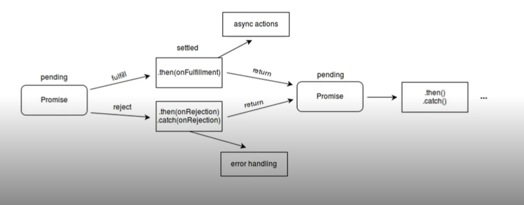

# Javascript Assíncrono
Principais pontos

1. Assincronicidade
- Assíncrono
  - Algo que não ocorre ou não se efetiva ao mesmo tempo
- O Javascript por padrão é síncrono, mas pode ser usado assincronamente
- Promises
  - Objeto de processamento assíncrono
  - Inicialmente, seu valor é desconhecido
  - Pode ser resolvido ou rejeitado
  - Pode ter 3 estados:
    - Pendente (pending)
    - Completa (fulfilled)
    - Rejeitada (rejected)
  
- Estrutura da Promise
  ```js
  const myPromise = new Promise((resolve, reject) => {
    window.setTimeout(() => {
      resolve('Resolvida');
    }, 2000);
  });

  await myPromise
    .then((result) => result + ' passando pelo then')
    .then((result) => result + ' e agora acabou!')
    .catch((err) => console.log(err.message));
  ```
- Async/Await
  - Funções assíncronas precisam dessas duas palavras
  ```js
    async function resolvePromise() {
      const myPromise = new Promise((resolve, reject) => {
        window.setTimeout(() => {
          resolve('Resolvida');
        }, 2000);
      });
    }

    const resolved = await myPromise
      .then((result) => result + ' passando pelo then')
      .then((result) => result + ' e agora acabou!')
      .catch((err) => console.log(err.message));
    
    return resolved
  ```
-----
2. APIs e Fetch
- API: Application Programming Interface
  - Meio de comunicação entre o back-end e o front-end
  - Acessado por meio de URLs
  - Usa, em geral, objetos JSON
- Fetch
  ```js
    fetch(url, options)
      .then(response => response.json)
      .then(json => console.log(json))
    
    fetch('endereco.com.br', {
      method: 'GET',
      cache: 'no-cache'
    })
      .then(response => response.json())
      .then(json => console.log(json))
  ```