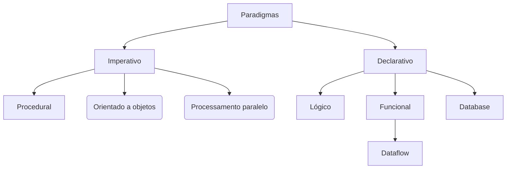

# Orientação a objetos
Principais pontos

1. Compreendendo a orientação a objetos
- Paradigmas da programação

- Imperativo: Foco em como resolver problemas
- Declarativo: O que fazer
- Pilares da Programação Orientada a Objetos (P.O.O.)
  - Herança
    - Propriedades e métodos transmitidos dos elementos pais para os elementos filhos
  - Polimorfismo
    - Objetos podem herdar a mesma classe pai, mas ter comportamentos diferentes
  - Encapsulamento
    - Cada classe tem propriedades e métodos independentes do restante do código
  - Abstração
    - Processo mental de isolar um aspecto de um estado complexo para simplificar sua avaliação, classificação ou comunicação
-----
2. Orientação a Objetos em JS
-  Protótipos
  - Todos os elementos não primitivos (objetos e arrays) do JS herdam propriedades e métodos de um prototype
  - No topo desta cadeia está o Object.prototype (`__proto__`) 
- Classes
  - Em JS, são feitas apenas para facilitar a escrita, não existindo originalmente
    ```js
      class Meal {
        constructor (food) {
          this.food = food
        }

        // Sintaxe a partir do ES6
        eat() {
          return ':P'
        }
      }
    ```
  - Por baixo dos panos, as classes usam objetos com protótipos
    ```js
      class Animal {
        constructor(type = 'animal') {
          this.type = type
        }

        get type() {
          return this._type
        }

        set type(val) {
          this._type = val.toUpperCase()
        }

        makeSound() {
          super.makeSound()
          console.log('Making animal sound!')
        }
      }

      class Cat extends Animal {
        constructor() {
          super('cat')
        }

        makeSound() {
          super.makeSound()
          console.log('Meow!')
        }
      }

      let animal = new Animal()
      console.log(animal.type)    // ANIMAL

      let cat = new Cat()
      console.log(cat.type)   // CAT
    ```