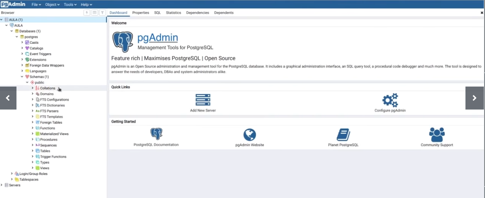

# Conceitos e melhores práticas com banco de dados PostgreSQL

## Introdução ao PostgreSQL
1. Fundamentos
- Dados: Qualquer conjunto de valores observados, que podem ser numéricos ou não
- Informação: Dados organizados, com estrutura definida e relações entre si que permitem gerar sentido e valor
- Modelo relacional:
  - Forma de organização dos dados em tabelas, no qual as linhas são as unidades observadas e as colunas são os atributos
  - Para ser possível criar a tabela, as linhas devem ter atributos em comum entre si
  - As colunas das tabelas são podem ser relacionadas entre si
- Chave Primária (Primary Key - PK)
  - Um ou mais campos que nunca se repetem
  - Formam a identidade da tabela
  - Usados como índice de refereência na criação das relações entre tabelas 
- Chave Estrangeira (Foreign Key - FK)
  - Referência a uma PK de outra tabela para criar um relacionamento
- Sistema de Gestão de Banco de Dados (SGBD)
  - Programas responsáveis por facilitar a administração de um banco de dados
  - Exemplos:
    - Oracle Database
    - PostgreSQL
    - MySQL
    - Windows SQL Server
    - MongoDB
    - ElasticSearch
    - IBM DB2
2. Introdução ao PostgreSQL
  - SGDB OpenSource desenvolvidona Universidade da Califórnia em 1986 
  - Arquitetura multiprocessos
    - postmaster
    - childs
    - memória
    - processos de escrita em discos
    - autenticação
    - conexões
    - storage
    - ...
  - Modelo cliente/servidor
  - Point in time recovery
  - Linguagem procedural com suporte a várias linguagens (perl, python, ...)
  - Suporte a dados geográficos (PostGIS)
  - Controle de concorrência multi-versão
  - Consultas complexas e Common table expressions (CTE)
  - Views, functions, procedures, triggers
  - [Site oficial](https://www.postgresql.org)
--------
3. Instalação e configuração
- A documentação oficial do PostgreSQL contempla todo o passo a passo do processo de instalação, disponível em [https://postgresql.org/download]
- A configuração servidor PostgreSQL de dados fica armazenada no arquivo `postgresql.conf`
  - Localizado, por padrão, no diretório PGDATA definido na inicialização do projeto
  - Algumas propriedades importantes:
    - LISTEN_ADRESSES: Endereços TCP/IPs que aos quais servidor permitirá o acesso, deve ser definido corretamente nos ambientes de produção
    - PORT: Porta do servidor
    - MAX_CONNECTIONS: Número máximo de conexões simultâneas
    - AUTHENTICATION_TIMEOUT: Tempo máximo de conexão do cliente com o servidor
    - SHARED_BUFFERS: Memória compartilhada do servidor para cache/buffer de tabelas, índices e outras relações
    - WORK_MEM: Memória específica para agrupamentos e ordenação (ORDER BY, DISTINCT, MERGE JOINS)
- O arquivo `pg_hba.conf`:
  - Define a autenticação dos usuários no servidor
  - Segue algum dos padrões: 
    - `local      database user auth-method [auth-options]`
    - `host       database user address auth-method [auth-options]`
    - `hostssl    database user address auth-method [auth-options]`
    - `hostnossl  database user address auth-method [auth-options]`
    - `host       database user IP-address IP-mask auth-method [auth-options]`
    - `hostssl    database user IP-address IP-mask auth-method [auth-options]`
    - `hostnossl  database user IP-address IP-mask auth-method [auth-options]`
  - Alguns métodos de autenticação
    - TRUST
    - REJECT
    - MD5
    - PASSWORD (não criptografada)
    - GSS
    - SSPI
    - IDENT
    - PEER 
    - ...
- O arquivo `pg_ident.conf`: 
  - Responsável por mapear usuários do sistema e usuários do banco de dados
- Alguns comandos administrativos no Ubuntu:
  - `pg_lsclusters`
  - `pg-createcluster <version> <clustername>`
  - `pg-dropcluster <version> <cluster>`
  - `pg-ctlcluster <version> <cluster> <action>`
- Arquitetura do PostgreSQL
  - Cluster: Coleção de bancos de dados com as mesmas configurações
  - Banco de dados: Conjunto de Schemas com seus objetos e relações 
  - Schema: Conjunto de objetos/relações (tabelas, funções, views)
-----
4. PGAdmin4
- Interface gráfica usada para interagir com o 
- Documentação no [site oficial](https://www.pgadmin.org)
- Importante para a conexão
  - Liberar acesso ao cluster em `postgresql.conf`
  - Liberar acesso ao cluster para o usuário em `pg_hba.conf`
  - Criar/editar usuários
  
-----
5. Administrando usuários
- Roles - Papéis desempenhados pelos usuários, com funções e permissões específicas 
- `CREATE ROLE name [ [WITH] option [...] ]`
- Alguns exemplos de permissões são:
  - SUPERUSER | NOSUPERUSER
  - CREATEDB | NOCREATEDB
  - CREATEROLE | NOCREATEROLE
  - LOGIN | NOLOGIN
  - INHERIT | NOINHERIT
  - ADMIN role_name
  - ROLE role_name
  - ...
- GRANT - concedendo privilégios de acesso
  - Podem ser relativos a um banco de dados, schema ou tabela específicos
  - Podem ser revocados com o comando REVOKE
  - P.ex. ``
-----
6. Comandos e dados
- Comandos para databases e Schemas
  - `CREATE DATABASE name [options]`
  - `ALTER DATABASE name RENAME TO new_name`
  - `DROP DATABASE name`
  - `CREATE SCHEMA schema_name [AUTHORIZATION role_specification]`
  - `ALTER SHEMA name RENAME TO new_name`
  - `DROP SCHEMA [name]`
  - Sempre que possível, use as opções IF EXISTS e IF NOT EXISTS
- Primary Key - características
  - Não podem se repetir em linhas diferentes na mesma
  - Não pode ser opcional (isto é, é sempre NOT NULLABLE)
  - É o conjunto mínimo de atributos que pode identificar uma instância
  - Não devem ser usadas chaves externas (há exceções)
  - Não pode ser volátil, alterável
  - Em geral, pode-se usar uma coluna ID quando houver vários atributos formando uma primary key
- Foreign Key 
  - É a referência em uma tabela a uma Primary Key de outra tabela
- Tipos de dados
  - Numeric
    - smallint
    - integer
    - bigint
    - decimal
    - decimal
    - numeric
    - real
    - double precision
    - smallserial
    - serial
    - bigserial
  - Character
    - varchar(n)
    - char(n)
    - text
  - Date/Time
    - timestamp (com ou sem timezone)
    - date
    - time (com ou sem timezone)
    - interval
  - Boolean
  - Monetary
  - Binary
  - Enumerated
  - Geometric
  - Network Address
  - Bit String
  - Text Search
  - UUID
  - XML
  - JSON
  - Arrays
  - Composite
  - Range
  - Domain
  - Object Identifier
  - pg_lsn
  - Pseudo-types
-----
## Fundamentos da Structured Query Language (SQL)
7. Data Manipulation Language e Data Definition Language
- DDL
  - CREATE, ALTER, DROP
  - Melhores práticas em DDL
    - Criar colunas que sejam atributos básicos do objeto
    - Moderação no uso de regras (constraints)
    - Moderação com as FKs (cuidado com o excesso)
    - Moderação no tamanho das colunas (p.ex. VARCHAR(255) para CEP)
- DML
  - INSERT, UPDATE, DELETE, SELECT
  - SELECT
    ```SQL
      SELECT (campos)
      FROM (tabela)
      [condições]
    ```
    - As condições sempre começam com WHERE e incluem os termos:
    - `= > >= < <= LIKE ILIKE IN AND OR`
    - Deve ser evitada a idempotência (2 SELECTS ANINHADOS)
      - É preferível o LEFT JOIN
    - Deve-se evitar o SELECT * (sempre especificar as colunas)
  - INSERT
    ```SQL
      INSERT (campos) VALUES (valores)
      INSERT (campos) SELECT (valores)
      [condições]
    ```
    - Evitar a idempotência 
    - ON CONFLICT, DO NOTHING
  - UPDATE
    ```SQL
      UPDATE (tabela) SET campo1 = novo_valor WHERE (condição)
    ```
    - Sempre usar a condição WHERE
  - DELETE
    ```SQL
      DELETE FROM (tabela) SET campo1 = novo_valor WHERE (condição)
    ```
    - Sempre usar a condição WHERE 
- TRUNCATE
  - Esvazia a tabela
  ```SQL
    TRUNCATE (tabela) (ONLY) name [*] [,...] [RESTART IDENTITY | CONTINUE IDENTITY] [CASCADE | RESTRICT]
   ```
-----
8. Funções Agregadas
- Computam resultados únicos a partir do valor das colunas
- Principais exemplos:
  - AVG
  - SUM
  - COUNT (having)
  - MAX
  - MIN 
-----
9. Relacionamento entre tabelas
- JOIN (INNER)
  - Interseção entre tabelas
  ```SQL
    SELECT tabela1.campos, tabela2.campos
    FROM tabela1
    JOIN tabela2
      ON tabela2.campo = tabela1.campo
  ```
  - Para melhor performance, usar campos que sejam Foreign Keys
- LEFT JOIN (OUTER)
  - Retorna a interseção entre as tabelas, mais os valores exclusivos da primeira tabela
  ```SQL
    SELECT tabela1.campos, tabela2.campos
    FROM tabela1
    LEFT JOIN tabela2
      ON tabela2.campo = tabela1.campo
  ```
- RIGHT JOIN (OUTER)
  - Retorna a interseção entre as tabelas, mais os valores exclusivos da segunda tabela
  ```SQL
    SELECT tabela1.campos, tabela2.campos
    FROM tabela1
    RIGHT JOIN tabela2
      ON tabela2.campo = tabela1.campo
  ```
- FULL JOIN (OUTER)
  - Retorna a interseção entre as tabelas, mais todas as combinações possíveis entre as tabelas
  ```SQL
    SELECT tabela1.campos, tabela2.campos
    FROM tabela1
    FULL JOIN tabela2
      ON tabela2.campo = tabela1.campo
  ```
  - Não recomendado, demanda muito do servidor
- CROSS JOIN
  - Retorna todas as possibilidades a interseção entre as tabelas, mais todas as combinações possíveis entre as tabelas
  ```SQL
    SELECT tabela1.campos, tabela2.campos
    FROM tabela1
    CROSS JOIN tabela2
   ```
  - Não recomendado, desperdício de recursos em produção
-----
10. Otimizando o código com CTE
- CTE = Common Table Expression
- Forma auxiliar de organizar `statements`, blocos de códigos, para consultas muito grandes
- Gera tabelas tamporárias e cria relacionamento entre elas
- Podem ser usados SELECTs, INSERTs, UPDATEs ou DELETEs
- WITH STATEMENTS
  ```SQL
    WITH npme1 AS (
      SELECT campos
      FROM tabelaA
      [WHERE]
    ), nome2 AS (
      SELECT campos
      FROM tabelaB
      [WHERE]
    )
    SELECT nome1.campos, nome2.campos
    FROM nome1
    JOIN nome2
  ```
-----
## Comandos Avançados da Structured Query Language (SQL)
11. Views
- Camadas paras as tabelas
- *Alias* para uma ou mais queries
- Aceitam comandos SELECT, INSERT, UPDATE E DELETE
- Caso haja JOINS, apenas o SELECT será aceito
- O uso de *views* é considerado uma boa prática
- Idempotência
  ```SQL
    CREATE OR REPLACE VIEW vw_bancos AS (
      SELECT numero, nome, ativo
      FROM banco
    );

    SELECT numero, nome, ativo
    FROM vw_bancos;
  ```
- INSERT, UPDATE e DELETE funcionam apenas para views de apenas uma tabela
- TEMPORARY VIEW
  - View disponível apenas na sessão do usuário
  - Ao se desconectar e conectar novamente, a VIEW não estará mais disponível
- RECURSIVE VIEW
  - Ocorre quando a VIEW chama a si própria
  - Obrigatória a existência dos campos da VIEW
  - Obrigatório o uso do UNION ALL
  - P.ex.:
    ```SQL
      CREATE OR REPLACE RECURSIVE VIEW vw_funcionarios(id, gerente, funcionarios) AS (
        SELECT id, gerente, nome
        FROM funcionarios
        WHERE gerente IS NULL
        UNION ALL
        SELECT funcionarios.id, funcionarios.gerente, funcionarios.nome
        FROM funcionarios
        JOIN vw_funcionarios ON vw_funcionarios.id = funcionarios.gerente
      );

      SELECT id, gerente, funcionario
      FROM vw_funcionarios
    ```
- VIEWS WITH OPTIONS
-----
12. Transações
- Conceito de múltiplos códigos ou etapas cujo resultado deve ser tudo ou nada
- Se algo ocorrer durante a transação, ela pode ser desfeita (*ROLLBACK*)
- Formato: `BEGIN [transações] COMMIT`
- Pode-se usar SAVEPOINTs, isto é, pontos intermediários de salvamento dentro do processo para o qual se pode fazer um *rollback*
-----
13. Funções
- Conjunto de códigos desenvolvidos (dentro de uma transação ou não, dependendo da linguagem e do banco de dados) para permitir o reaproveitamento de código
-  Podem ser:
  - SQL
  - Linguagens procedurais (PL/pgSQL, PL/py)
  - internal functions
  - C-language functions
- Nosso foco é funções definidas pelo usuário
- Idempotência - CREATE OR REPLACE - deve obedecer
  - Mesmo nome
  - Mesmo tipo de retorno
  - Mesmo número de parâmetros/argumentos
- No retorno deve haver a palavra RETURNS (ou RETURN, dependendo da linguagem)
- A segurança é definida (SECURITY - INVOKER ou DEFINER)
- Comportamento
  - IMMUTABLE
  - STABLE
  - VOLATILLE
- Recursos
  - COST
  - ROWS