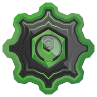

# Instalando e configurando seu ambiente Node.js
Instrutor: Felipe Aguiar

## 1. O que é Node
### a) Apresentação
* O Javascript sempre foi uma linguagem para desenvolvimento de front end
* Com a disseminação do NodeJS, o javascript passou a ser usado também para o backend
* Node => JS no front e no backend
* Isso tornou muito mais acessível a formação de *fullstack devs* :man_technologist::woman_technologist:
* Node => Muita aceitação no mercado => Muitas oportunidades

### b) O que é o Node.JS
* O Node não é:
  * uma linguagem de programação,
  * um Framework
* O Javascript sempre cuidou da lógica e pela inteligência nas páginas Web para deixá-las dinâmicas
* Os navegadores possuem motores ou engines que executam o JS 
* Ryan Dahl se baseou no Javascript V8 Engine do google Chrome e na Libuv para criar o NodeJS

  * Javascript V8 engine = Motor de interpretação de JS desenvolvido pela Google e utilizado no Chrome
  * Libuv = Biblioteca em C usado para lidar e manipular com arquivos do sistema
* O Node é um interpretador que permite rodar JS não apenas no browser, mas em qualquer lugar
* Pode ser usado para:
  * Interagir com Bancos de Dados
  * Criar servidores e Web Apps
  * Se comunicar com outras Apps
  * Trabalhar com websockets e apps em tempo real

### c) O que é o NPM
* NPM = Node Package Manager
* É o gerenciado de pacoter do Node
* Permite o reaproveitamento de pacotes prontos de código :heart:
* Facilita a integração e acelera o desenvolvimento de aplicações
* [No site do npm](https://www.npmjs.com/) é possível pesquisar pacotes por palavras-chave

## 2. Instalando o Node
* O NodeJS pode ser baixado no site oficial https://nodejs.org/en/
* Leia a documentação: tudo que se precisa para usar o Node está no próprio site oficial
* O Node é mantido pela fundação OpenJS atualmente
* O fundador Ryan Dahl atualmente está envolvido em outros projetos, como o Deno

## 3. Editores de código
* Vantagens em relação a um simples editor de texto
  * *Sintax highlight*
  * *Autocomplete*
  * Organização das pastas e arquivos
  * Customização
  * *Plugins* e extensões diversas
* Principal editor utilizado = Visual Studio Code (VS Code)

## 4. Executando o node
### a) Hello World
* Após instalado, o node pode ser executado a partir da CLI com o comando *node*
* P.ex. O comando `node index.js` interpreta o arquivo index.js
* Em geral, executar um código na CLI com o comando `node` ou console do browser terá o mesmo resultado (desde que tratadas as dependências)

### b) Package.json
* Iniciar um projeto em NodeJS depende de um arquivo especial de configuração chamado _package.json_
* Para isso, inicializamos o projeto com `npm init` (e preencher as informações necessárias)
* A partir daí, o arquivo _package.json_ estará criado com as informações fornecidas na inicialização do projeto